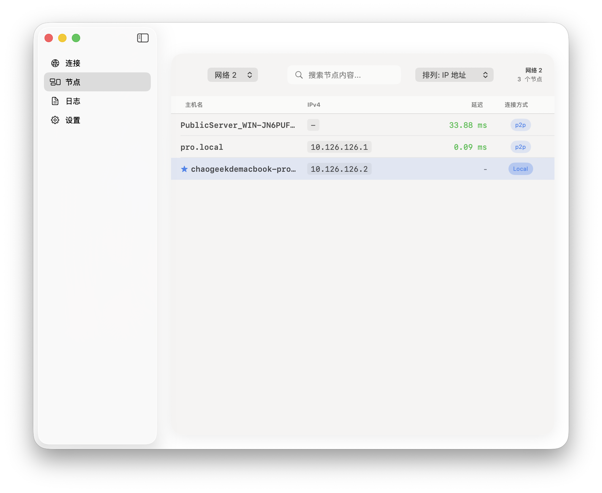
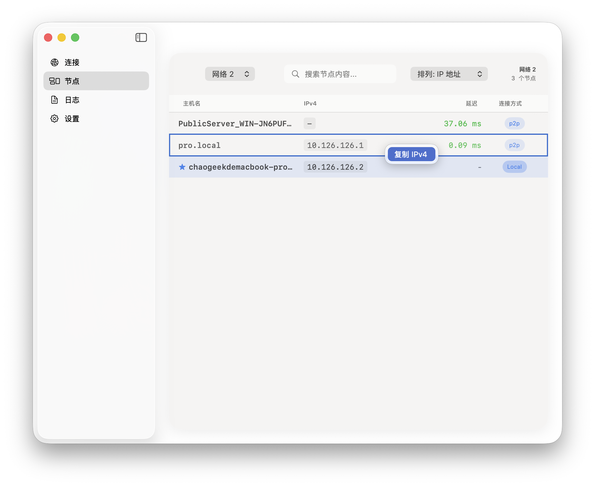
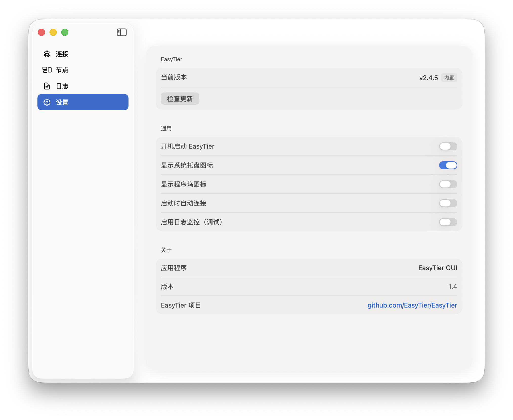

# EasyTier GUI

[-lightgrey)](https://www.apple.com/macos)
[](https://swift.org)
[](LICENSE)

一个用于 [EasyTier](https://github.com/EasyTier/EasyTier) 的 macOS 原生图形界面应用程序。

## 截图

| 连接页面 | 节点页面 | 设置页面 |
|:---:|:---:|:---:|
|  |  |  |

## 功能特性

- 🖥️ **原生 macOS 体验** - 使用 SwiftUI 构建，支持 Intel 和 Apple Silicon
- 🔧 **完整配置支持** - 网络名称、密码、服务器地址、主机名等
- ⚡ **高级选项** - 延迟优先模式、私有模式、DNS 配置、多线程、KCP 代理
- 📋 **多配置管理** - 保存、导入、导出多个网络配置，支持同时运行多个网络
- 🔄 **自动恢复连接** - 重启后自动恢复上次运行的所有网络连接
- 👥 **节点监控** - 实时查看已连接节点和延迟信息，支持搜索和排序
- 📝 **日志查看** - 带过滤和搜索的实时日志，支持独立开关
- 🎯 **系统托盘** - 菜单栏图标显示连接状态，快速访问
- 🔐 **内置核心** - EasyTier 核心内置，支持自动更新

## 系统要求

- macOS 14.0+ (Sonoma)

## 安装

### 从 DMG 安装

1. 下载 `EasyTierGUI.dmg`
2. 打开 DMG，将应用拖入 Applications 文件夹
3. 首次打开应用时，macOS 可能会要求授权，请在系统偏好设置中允许

### 从源码编译

```bash
# 克隆仓库
git clone https://github.com/your-username/easytier-gui.git
cd easytier-gui

# 构建
./build.sh

# 运行
./launch-easytier-gui.sh
```

## 使用说明

### 快速开始

1. **启动应用** - 打开 EasyTier GUI
2. **创建网络** - 点击左下角 `+` 添加新配置，填写网络名称和密码
3. **连接** - 点击连接按钮，授权后即可加入网络

> 💡 EasyTier 核心已内置，首次启动会自动检测更新，无需手动下载。

### 多网络管理

应用支持同时运行多个虚拟网络配置：

- 在左侧网络列表中选择不同配置
- 每个配置独立运行，互不干扰
- 关闭应用后重新打开会自动恢复之前运行的所有网络

### 配置说明

| 字段 | 说明 | 必填 |
|------|------|------|
| 网络名称 | 组网标识符 | ✅ |
| 网络密码 | 组网密钥 | ✅ |
| 服务器地址 | 对端节点地址 (如 `tcp://1.2.3.4:11010`) | ✅ |
| 主机名 | 本机显示名称 | ❌ |
| DHCP | 自动分配虚拟 IP (推荐) | ❌ |
| 静态 IP | 手动指定虚拟 IP | ❌ |

### 高级选项

| 选项 | 说明 |
|------|------|
| 延迟优先 | 优先选择低延迟路径 |
| 私有模式 | 不响应来自公共网络的请求 |
| Magic DNS | 启用 DNS 功能，可通过主机名访问节点 |
| 多线程 | 启用多线程模式提升性能 |
| KCP 代理 | 启用 KCP 协议代理 |

## 故障排除

### TUN device error: Operation not permitted

EasyTier 需要权限创建 TUN 网络设备。应用会自动请求授权，请在弹出的对话框中输入密码授权。

如果仍然失败，可以尝试：

```bash
# 从终端以 root 运行
sudo /Applications/EasyTierGUI.app/Contents/MacOS/EasyTierGUI
```

### 连接失败

1. 检查网络名称和密码是否正确
2. 确认服务器地址格式正确 (如 `tcp://ip:port`)
3. 检查防火墙设置
4. 查看日志获取详细错误信息

## 构建与打包

```bash
# 构建 Universal Binary (Intel + Apple Silicon)
./build.sh

# 打包 DMG
./create-dmg.sh
```

### 更换应用图标

使用 `generate-icons.sh` 脚本从 PNG 图片生成 macOS 应用图标：

```bash
# 准备一张 1024x1024 的正方形 PNG 图片
./generate-icons.sh ./logo.png
```

要求：
- 源图片必须是正方形
- 推荐尺寸 ≥ 1024x1024
- 脚本会自动生成所有需要的尺寸到 `Assets.xcassets/AppIcon.appiconset`

## 技术栈

- **语言**: Swift 5.9
- **框架**: SwiftUI, AppKit
- **架构**: MVVM
- **最低版本**: macOS 14.0

## 许可证

[MIT License](LICENSE)

## 致谢

- [EasyTier](https://github.com/EasyTier/EasyTier) - 强大的 P2P 组网工具
- [Claude (Anthropic)](https://www.anthropic.com/claude) - AI 辅助开发

---

> 本项目由 Claude AI 辅助开发完成
